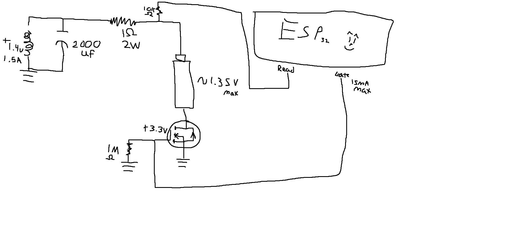

# ESP32-NiMH-Charger
 NiMH battery charger using ESP32. Max battery voltage ~1.35V charging using ONLY CV.

Rough schematic with one holder circuit for ~0.9V -> 1.35V, battery holder charge for 0.9V would be ~500mA. Ensure that your batteries can handle this charge.
My physical design implements a slow charger for batteries more dead than 0.9V for a safer charge. Using 22 ohms instead of a 1 ohm resistor at the top of the image, 0.9V battery would be charging at ~23mA. Ensure that your batteries can handle this charge.

